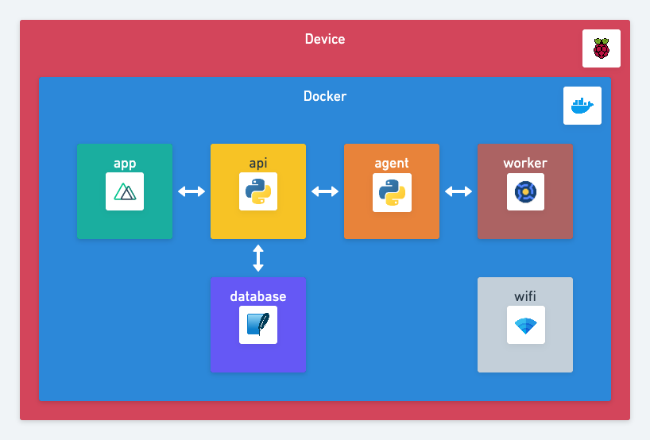

# Architecture 🏠

## Overview 👀

Scitizen is composed of 5 distinct services.

| Service             | Role                                                   | Doc                                |
|---------------------|--------------------------------------------------------|------------------------------------|
| 👮 `agent`          | A daemon syncing the worker config and data            | [README](agent/README.md)          |
| 🚦 `api`            | A RESTful API serving as an interface for the database | [README](api/README.md)            |
| 💻 `app`            | A web server delivering the web app                    | [README](app/README.md)            |
| 🌐 `wifi        `   | A web interface to connect to Wi-Fi                    | [README](wifi/README.md)   |
| 👷‍♂️ `worker`         | A BOINC instance running scientific workloads          | [README](worker/README.md)         |
