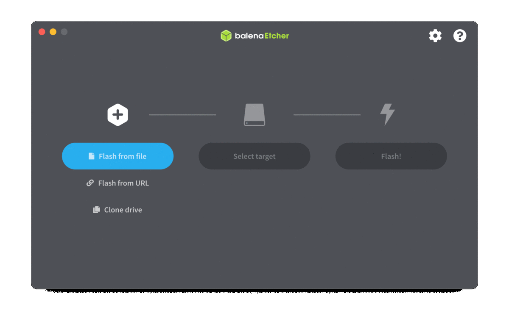
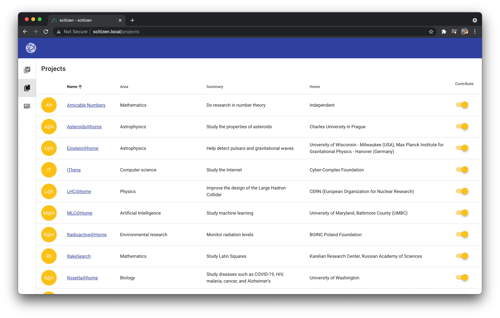
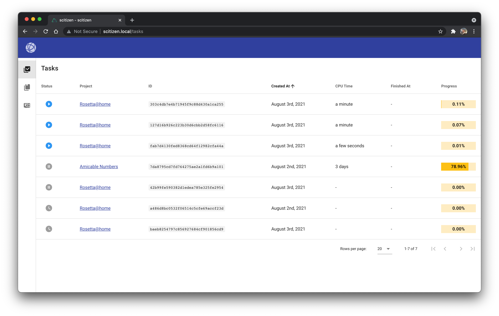

# Scitizen - Help scientific research for the benefit of mankind and humanity 🔬

**Scitizen has been built from the ground up to give everyone the possibility to contribute to scientific research ✨. No Ph.D. required 🧑‍🎓.**

## ✨ Overview

You want to make the world a better place for future generations 🌱?

From computing molecules interactions for biomedical and environmental research 🧬, analyzing pictures took by astronomical space telescopes to find a new home for humanity 🔭, piercing the secrets of quantum physics by improving the design of the Large Hadron Collider 🧲, you can do it all from home 🏠.

So let's start contributing 💪!

## ✅ Prerequisites

* A [Raspberry Pi](https://www.raspberrypi.org/) 3/4 device (versions 1/2 are currently not supported)
* A micro-SD card (32 GB at least is recommended)
* An ethernet cable and/or a Wi-Fi network name and password

## 🪄 Installation

1️⃣ Download the latest image of Scitizen on Balena

2️⃣ Download and install Balena Etcher

3️⃣ Open BalenaEtcher
* Click on the `Flash from file` button.
* Select the Scitizen file you downloaded in 1️⃣.
* Click on the `Select target` button.
* Select your micro-SD card.
* Click on the `Flash!` button.
* Wait for the image to be written and verified.
* Congratulations 👏! You have successfully installed Scitizen on your micro-SD card 🥳

4️⃣ Insert your micro-SD card into your Raspberry Pi, and power it up.
Depending on your internet connection, it could take up to 30 minutes to fully boot.

5️⃣ On a computer on the same network (i.e. Modem / Wi-Fi) than the Raspberry Pi, open in your browser the URL `http://scitizen.local`.

## ✨ Usage

* Choose the projects you want to contribute to

* Check the tasks that you contributed to

* Let your Raspberry Pi make the world a better place 🌱

## 🙏 Acknowledgement

First 🥇, we wanted to thanks the Raspberry Pi Foundations for creating devices as awesome as the Raspberry Pis.

Second 🥈, we wanted to thanks the Berkeley University of California 🏫 for creating [BOINC](https://github.com/BOINC/boinc) and for sharing it with the whole world 🌏.

Third 🥉, we wanted to thanks all the community behind BOINC and all the projects available on it to make the world a better place 🌱.

## 💌 Contacts

If you need help and/or have a question on Scitizen, please open-up an issue on the Github [repository](https://github.com/pcorbel/scitizen/issues).

## 📚 License

Scitizen is under the [Apache 2](./LICENSE) license.