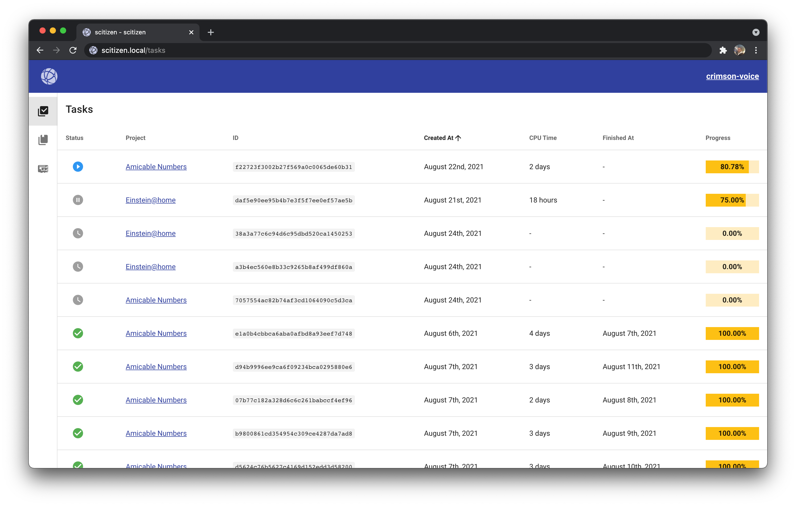

# Scitizen - Help scientific research for the benefit of mankind and humanity 🔬

**Scitizen has been built from the ground up to give everyone the possibility to contribute to scientific research ✨. No Ph.D. required 🧑‍🎓.**

## ✨ Overview

You want to make the world a better place for future generations 🌱?

From computing molecules interactions for biomedical and environmental research 🧬, analyzing pictures took by astronomical space telescopes to find a new home for humanity 🔭, piercing the secrets of quantum physics by improving the design of the Large Hadron Collider 🧲, you can do it all from home 🏠.

So let's start contributing 💪!

## ✅ Prerequisites

* A [Raspberry Pi](https://www.raspberrypi.org/) 3/4 device (1 GB RAM at least is recommended)
* A micro-SD card (32 GB at least is recommended)
* [Balena Etcher](https://www.balena.io/etcher/) downloaded and installed on your workstation
* An ethernet cable and/or a Wi-Fi network name and password

## 🪄 Installation

1️⃣ Download the latest image of Scitizen OS on the [Release page](https://github.com/pcorbel/scitizen/releases)

2️⃣ Open BalenaEtcher
* Click on the `Flash from file` button.
* Select the Scitizen OS image file you downloaded in 1️⃣.
* Click on the `Select target` button.
* Select your micro-SD card.
* Click on the `Flash!` button.
* Wait for the image to be written and verified.
* Congratulations 👏! You have successfully installed Scitizen OS on your micro-SD card 🥳.

3️⃣ Insert your micro-SD card into your Raspberry Pi, and power it up 🔋.
Depending on your internet connection, it could take up to 10 minutes to fully boot ⏳.

4️⃣ If your Raspberry Pi is **not** connected to the Internet via ethernet 🔌
* A Wi-Fi hotspot named `Scitizen` will appear on your network list (computer or smartphone)
* Connect to it (there is no password)
* While connected to it, open [http://192.168.42.1:8000](http://192.168.42.1:8000)
* Select your Wi-Fi network name (SSID), enter the passphrase and click on `Connect`.

5️⃣ On a computer 💻 on the same network (i.e. Modem / Wi-Fi) than the Raspberry Pi, open in your browser the URL `http://scitizen.local`.

5️⃣ bis: You have more than one device to share with the world 🌎? No problem 🤗.

Just go to `http://scitizen-2.local`, `http://scitizen-3.local`, etc... to see the contribution of all your devices.

## ✨ Usage

### [scitizen.local/projects](http://scitizen.local/projects)

Choose the projects you want to contribute to

### [scitizen.local/tasks](http://scitizen.local/tasks)

Check the tasks that you contributed to

### [scitizen.local/devices](http://scitizen.local/devices)

Check data on your device

## 🤝 Contributing

Thanks for helping Scitizen reaching more people and being more stable and user friendly ✨.

To contribute, please see our [contribution guidelines](CONTRIBUTING.md).

## 🙏 Acknowledgement

First 🥇, we wanted to thanks the Raspberry Pi Foundations for creating devices as awesome as the Raspberry Pis.

Second 🥈, we wanted to thanks the Berkeley University of California 🏫 for creating [BOINC](https://github.com/BOINC/boinc) and for sharing it with the whole world 🌏.

Third 🥉, we wanted to thanks all the community behind BOINC and all the projects available on it to make the world a better place 🌱.

## 💌 Contacts

If you need help and/or have a question on Scitizen, please open-up an issue on the Github [repository](https://github.com/pcorbel/scitizen/issues).

## 📚 License

Scitizen is under the [Apache 2](./LICENSE) license.
