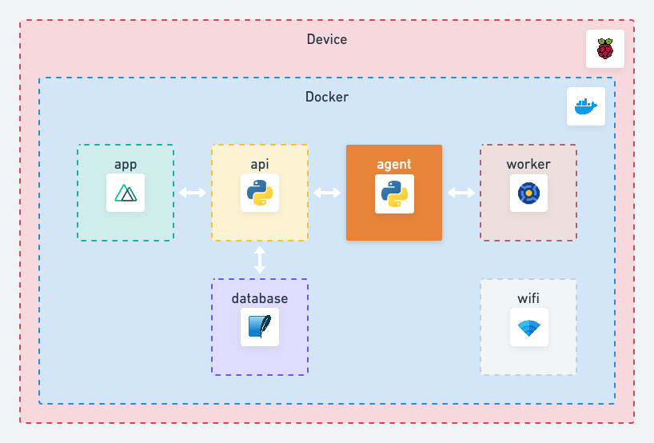

# Agent 👮

The `agent` service is the coordinator of Scitizen.

On a regular interval (30 seconds by default), the `agent` will:

* apply config fetched from the `database` via the `api` onto the BOINC `worker`.
* fetch tasks data from the BOINC `worker` and store them in the `database` via the `api`.
* fetch host data from the BOINC `worker` and store them in the `database` via the `api`.
