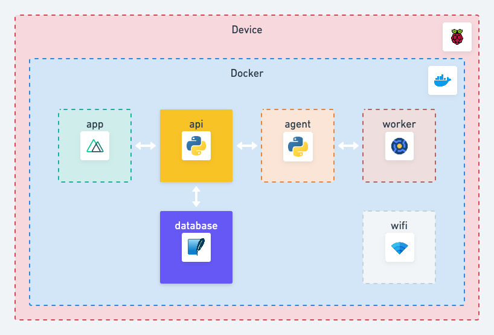

# API 🚦

The `api` service is the only interface for the `database`.

The `api` will allow:
* the `agent` to have read access to the config.
* the `agent` to have write access to tasks and host data.
* the `app` to have read/write access to the config.
